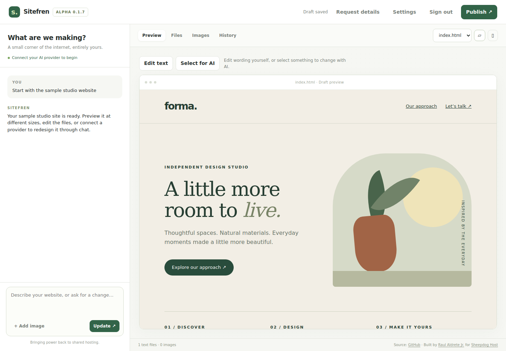

# Sitefren

**Your hosting’s new best friend.**

An open-source AI website editor for shared hosting. Upload one PHP file,
describe your site, and publish real HTML, CSS and JavaScript files you own.

**Alpha 0.2.1** · **PHP 8.2+** · **AGPL-3.0-only**

[Download sitefren.php](https://github.com/raldjr/sitefren/releases/download/v0.2.1/sitefren.php)
· [Get started](docs/INSTALLATION.md)
· [Changes](CHANGELOG.md)
· [Report a bug](https://github.com/raldjr/sitefren/issues/new/choose)



## A real website on the hosting you already have

Sitefren is for business owners, freelancers and anyone who wants to turn an
unused domain into a working website. It runs on compatible shared hosting,
including Sheepdog Host. No Composer, Node.js, database, build step, subscription
to Sitefren, or extra application upload is required. AI provider usage is billed
separately by the provider you connect.

## What you can do

- Describe a website and refine it through conversation.
- Edit text directly in the preview without an AI request.
- Select an element and ask AI to change it.
- Edit source files, upload images and preview desktop/mobile layouts.
- Drag one or more images onto the prompt area, or click **+ Add image**.
- Restore earlier drafts with History.
- Publish ordinary site files to your hosting, with conflict checks.
- Choose OpenRouter or Concentrate and your own supported model.
- Try a sample site without an API key.

The editor is one PHP file. Your published website can contain multiple pages,
stylesheets, scripts and images, and continues to work independently of Sitefren.

## Start in a few steps

1. [Download sitefren.php](https://github.com/raldjr/sitefren/releases/download/v0.2.1/sitefren.php). If your browser displays source, save the raw file as `sitefren.php`.
2. Upload **only that file** into an empty folder on compatible hosting.
3. Visit `https://your-domain.example/sitefren.php` (include your folder if needed).
4. Open the automatically created `builder-state.php` in your hosting file manager.
   Copy its one-time setup code into the editor and choose your password.
5. Try the sample, or open Settings to connect your AI provider and model.
6. Describe or edit your website. Review the draft, then click **Publish**.

Opening the editor creates a coming-soon `index.html` if no existing homepage is
present. Publish replaces that placeholder. Do not upload private state files to
GitHub or share them with anyone.

## Hosting requirements

| Requirement | Purpose |
| --- | --- |
| PHP 8.2 or later, with JSON and sessions | Run the editor and sign-in |
| PHP cURL with working HTTPS certificate verification | Connect to AI providers |
| HTTPS for the editor | Protect passwords and requests |
| Writable project/private-state storage | Save drafts, images and published files |
| Outbound HTTPS to your chosen provider | Make AI requests |
| Static HTML/CSS/JS/image serving | Serve the published website |

PHP 8.3 was used for local validation. Test your actual hosting configuration
before a customer rollout. No special daemon, cron task or shell access is
required by the uploaded application.

## Upgrading

Back up `builder-state.php` and your published files. Replace only `sitefren.php`
and reload. Existing drafts, password and saved provider settings remain.

Moving from the earlier `builder.php` filename? Upload `sitefren.php` into the
same folder, sign in, then remove the old editor. **Keep `builder-state.php`.**

The editor checks the official GitHub release feed after sign-in, caching successful
checks for a day. A newer published version shows an update link in the footer;
Settings also has **Check for updates**. Failed checks retry on a later visit after
an hour. Manual checks are limited to once a minute. These checks send the app
version as a user agent, but no installation ID, customer URL, project data, or
provider key. GitHub receives the hosting server's IP through the connection.
Set `POCKET_UPDATE_CHECKS=0` to disable checks. From 0.2.0, Settings offers **Update now** for newer signed releases on compatible
hosts. It verifies the download, backs up the editor and state, and replaces only
the editor. Older builds need one manual upload to gain this feature. Customized
editors keep the manual upgrade path. See [updates](docs/UPDATES.md).

## Hosting and setup help

The editor includes a labeled Sheepdog Host advertisement with links to explore
hosting or email `hello@raul.ws` for setup help. Contact is voluntary;
the email link contains only a generic subject, with no project data attached.
The ad is embedded text, without an ad network, remote images, or tracking script,
and is never inserted into published websites.
The promotion is a compact card between the workspace tabs and preview controls.
On narrower screens it moves to its own toolbar row. Separate help links remain available
on setup/sign-in and in the editor header, even if a browser hides the advertisement.
For an image-and-text creative, the publisher can set `PS_SPONSOR_IMAGE` in the PHP
file to an embedded image data URI (for example, a base64 PNG). Artwork fits inside
a 72×48-pixel area without cropping; an empty value keeps the ad text-only. No
separate image upload or external image request is required by the installed editor.

## Installation counting

On the first production visit that initializes private state, Sitefren automatically
sends an `installation_created` event to our self-hosted Rybbit instance at
`analytics.molondigital.com`. It contains a random installation ID and app version.
The event uses the fixed analytics label `installs.sitefren.com`; it does not send
your site's domain, URL, content, prompts, credentials, or visitor information.
The analytics service receives your hosting server's IP address through the
connection and may derive network/location information or retain it in server logs.
This is installation counting, not anonymous browsing analytics or a sales contact list.

The ID and delivery status are saved in `builder-state.php`. Reloads and upgrades
keep that identity; copied state shares it, and deleting state creates a new one.
Existing installations register when first visited after this update. Delivery
uses PHP cURL with a 1.5-second limit, outside the project lock, at request shutdown.
Failures do not change the editor result; another visit may retry after 24 hours.
Delivery is best effort, so counts can miss installations or contain repeat events;
count distinct `installation_id` values on this event instead of raw event totals.

Set the hosting environment variable `POCKET_INSTALL_TRACKING=0` before opening
the editor to disable reporting. PHP CLI and its built-in development server never
automatically report. No tracking script is added to the editor or published sites.

## Alpha scope and limitations

- Generated sites are currently static. Generated PHP, databases, e-commerce
  backends and functioning server-side contact forms are not supported.
- Current storage limits: 30 text files, 120 KB per file, 250 KB combined text,
  12 uploaded images and 10 history snapshots.
- AI output can fail validation, exceed its output allowance or hit a hosting
  timeout. Invalid edit batches preserve the saved draft.
- Follow-up edits can use small exact replacements. Models may still return
  full rewrites; completion is not guaranteed.
- Generation is not a durable background job. Closing the browser or a hosting
  worker timeout may interrupt it.
- Existing unrelated websites cannot be imported or overwritten automatically.
- Preview isolation does not make arbitrary published JavaScript safe.

See [security boundaries](SECURITY.md), [validation evidence](VALIDATION.md),
and the [detailed installation guide](docs/INSTALLATION.md).

## Troubleshooting

| Symptom | What to check |
| --- | --- |
| Cannot finish setup | Correct filesystem setup code, HTTPS, ownership and writable storage |
| Provider rejects the request | Exact model ID, key permissions, credits, structured-output support and ZDR route |
| Generation times out | Request details, configured wait limit and hosting PHP/proxy logs |
| Output is cut off | Token usage in Request details; try a smaller change or a different supported model |
| Old error keeps appearing | Click Dismiss; request diagnostics remain available |
| Publish reports a conflict | A file was changed externally or belongs to another application; preserve it and resolve the conflict |

Never post API keys, passwords, setup codes, private state, or customer content
in a public issue. Use synthetic examples and sanitized request diagnostics.

## Contributing and development

See [CONTRIBUTING.md](CONTRIBUTING.md), [the roadmap](docs/ROADMAP.md),
and [the authentication overview](docs/AUTHENTICATION.md).

```sh
php -l sitefren.php
php tests/core.php
php -d disable_functions=curl_init,curl_setopt_array,curl_exec,curl_getinfo,curl_close tests/installations.php
php -d disable_functions=curl_init,curl_setopt_array,curl_exec,curl_getinfo,curl_close tests/updates.php
node tests/image-drop.cjs
POCKET_TEST_TRANSPORT=1 python3 tests/integration.py
```

The image-drop handler checks require Node.js and no extra packages.
Browser tests additionally require Playwright and Chromium. Tests use synthetic
provider responses; they do not require a live API key. GitHub Actions runs core
and HTTP checks. Browser and live-host validation are separate checks.

## License and your websites

Sitefren is licensed under [GNU AGPL version 3](LICENSE). Commercial use is
allowed, including building paid client websites. AGPL obligations apply to the
editor and covered modifications, including relevant network-use source offers.

Using Sitefren does not by itself place your generated website under AGPL.
Third-party assets and code you incorporate retain their applicable terms.
The license does not grant permission to imply endorsement by Sitefren or
Sheepdog Host. Identify unofficial forks clearly. See [licensing notes](docs/LICENSING.md).

## Built for shared hosting

**Bringing power back to shared hosting.**

Built by [@raultechnically](https://raul.ws) for [Sheepdog Host](https://sheepdoghost.com).
Sitefren works on other compatible hosts too; no required hosting purchase or
customer-site backlink. This repository contains the application and docs;
the public marketing website is intended to run on Sheepdog Host shared hosting.
